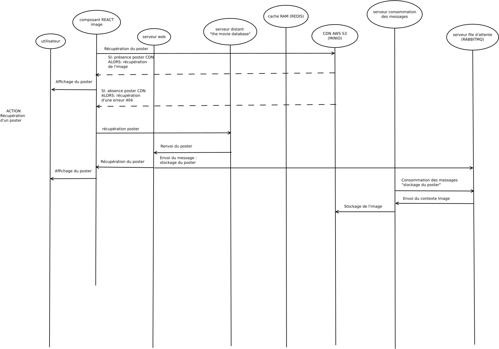

# Objectif du projet 

## Version initiale 
La version initiale a été pensé de manière minimaliste afin de répondre au [cahier des charges suivant](./test-we-cine-2021.pdf). L'architecture est uniquement constitué d'un serveur web et avait pour priorité de valider l'approche algorithmique et le respect aux normes standards (SOLID ...). Le diagramme de traitement associé peut être résumé comme suit : 


## Version évoluée
La version initiale, par trop minimaliste, ne mettait pas en valeur les besoins d'une application moderne. Les principales améliorations apportées sont notamment : 

* Intégration de REACT comme moteur de rendu
* Mise en place de web services via API PLATFORM
* Import asynchrone des films et images à l'aide de RABBITMQ
* Ajout de mécaniques d'optimisation pour privilégier le requête en base de donnée aux appels distants de l'API "the movie database"
* Activation du cache RAM REDIS pour optimiser les chargements des contrôleurs 
* Stocker les images sur un CDN AWS S3 à l'aide de MINIO

### Architecture pour la récupération de la liste des films 


### Architecture pour la récupération d'une image



# Installation

## Pré-requis

Docker 23.7 et GIT 2.34 doivent préalablement être installé en ligne de commande

# Guide d'installation de l'environnement

1. Créer un répertoire de travail dans lequel sera déposé les sources
```
mkdir propal-we-cine-2021 &&
cd propal-we-cine-2021 &&
git clone https://git.intranet.dita-transport.com/dita-services/propal-we-cine-2021/local.git &&
git clone https://git.intranet.dita-transport.com/dita-services/propal-we-cine-2021/webapp.git &&
mkdir -p local/php8/log/apache2/webapp &&
mkdir -p local/php8/share/webapp &&
cd local &&
docker compose up -d
```

2. Installation de webapp

Se reférrer à *../webapp/README.md*

3. Installation de minio 

Cette étape, il faut se connecter à l'interface web (http://localhost:9001). Les actions à mener sont les suivantes : 
* Création d'utilisateur MINIO 
Cliquez sur Identity, Users, puis Create a user.
Définissez une access key (username), une secret key (password) et sélectionnez la politique d'accès "readwrite", ensuite créer le bucket *documents*.
Ces variables sont référencé au sein de webapp respectivement par MINIO_ACCESS_KEY, MINIO_SECRET_KEY et MINIO_BUCKET au travers du .env .

Créer ensuite un second utilisateur avec des droits en lecture seule. Il sera renseigné sur webapp par MINIO_READER_ACCESS_KEY et MINIO_READER_SECRET_KEY.

Important: La configuration est essentielle pour que les tests de validation sur MINIO soient opérationnels